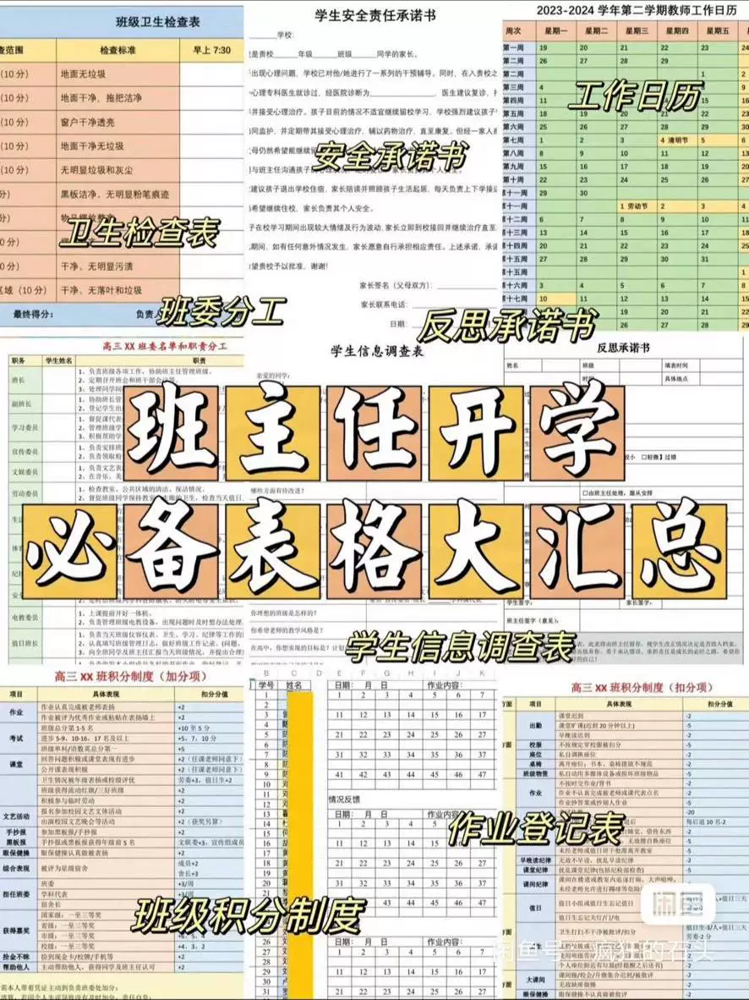
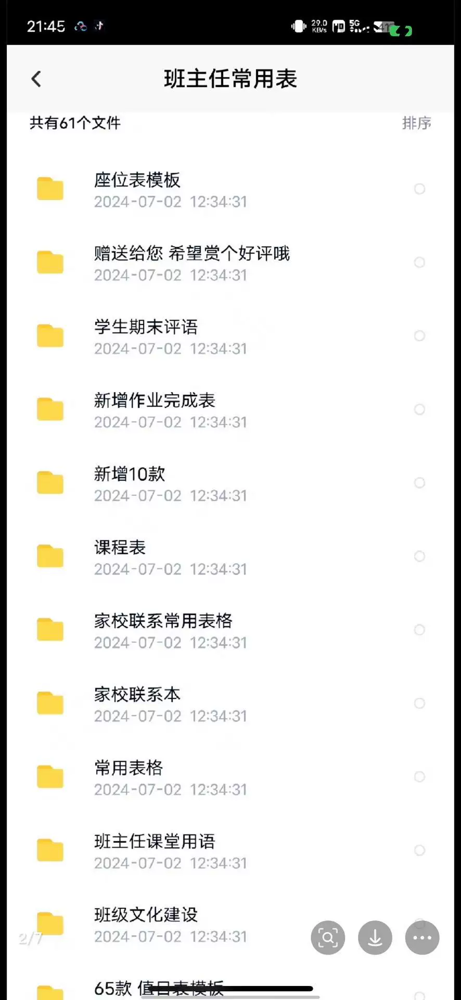
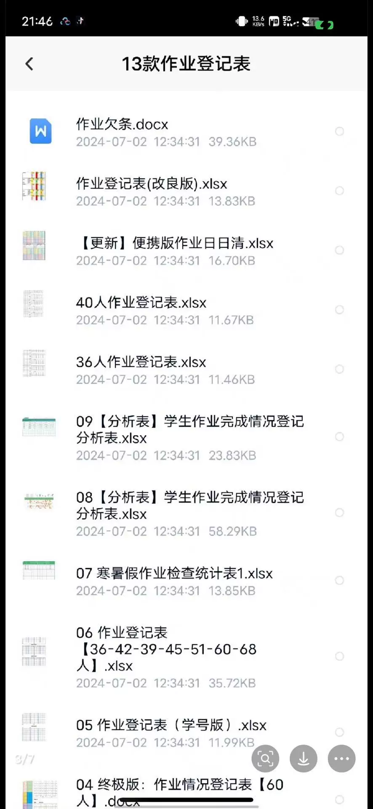
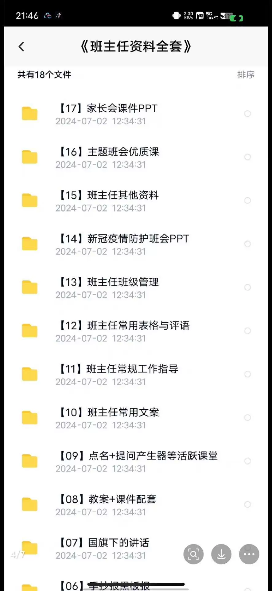
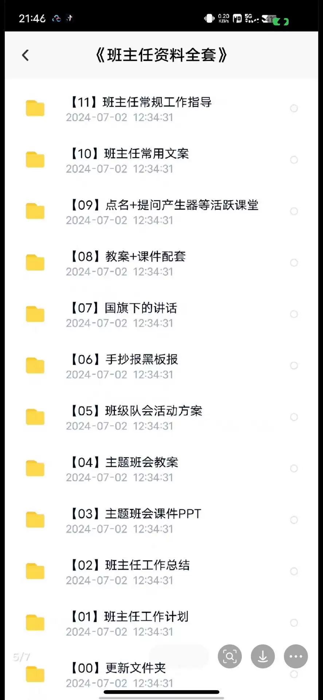
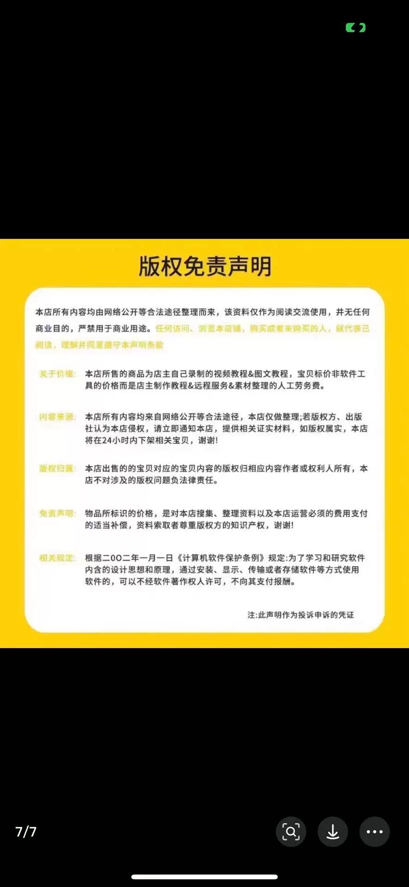

# 【Instant Delivery】Homeroom Class Management Common Tables: Seating, Daily Roster, Home Visitation, Assignment Checklist

## Body

【Instant Delivery】Classroom Management Essential Forms for Homeroom Teachers: Seating Chart, Daily Roster, Homework Checklist, Visitation Schedule, and Student Records.

【Instant Delivery】Classroom Management Essential Forms for Homeroom Teachers: Seating Chart, Daily Roster, Homework Checklist, Visitation Schedule, and Student Records.

Baidu NetEase Cloud Disk 24-hour automatic shipping

Student Status Form [Fire]
Ensure you have this ready for the start of school. [image][image] This is a must-have tool for new homeroom teachers. || [image] School Start Survey Form

Upon the start of the school term, it's not yet clear about the students. They are asked to fill out a survey form. [image] The homeroom teacher can also use this form to arrange temporary class committee members, which is both convenient and efficient.

[image] Class Committee Roles
Newly appointed class teachers may not know how to set up a strong class committee. Here is a table that can serve as a reference for setting up a powerful class committee, which can assist the teacher in managing the class and handle numerous class affairs.

[image] Points system
I have divided into two sections: deduction and addition. Each project has its corresponding responsible person, with the class monitor responsible for summarizing points behind and rewarding those who clean up by handing over the directives to the home committee.

[image] Reflective Sheet
What to do when students engage in mischief during class or fail to submit assignments? With a reflective sheet, students have something to fear, understanding that making mistakes comes with costs and consequences. They will no longer take liberties lightly. [image]

[image] Homework registration book

Due to a lack of interest in frequently printing, I have directly prepared a homework registration book for the class representative. This can serve as a heirloom and divide students by color. The group leader will collect all group members' homework before handing it over to the class representative, ensuring no one escapes their homework obligations.

[image] Health Checklist
Make it specific to each item, clearly visible, and see the health deductions clearly. [image]♀[image]

[image] Home Visit Record Form and Safety Responsibility Letter
Any time we engage in moral education, we must leave a trace. In case of any incident, these can be used to protect us.

[image] Work Calendar
The work and holiday situation is clearly visible, so I'm already looking forward to summer vacation.

## A must-have for tutoring homework

## Images

## Payment

Here is a pay link on Stripe ( https://buy.stripe.com/3cs8yP7sY87d0vu9AB ). Please contact me lonlonago@foxmail.com after funding $89, and I will send you a complete data files , thank you!

